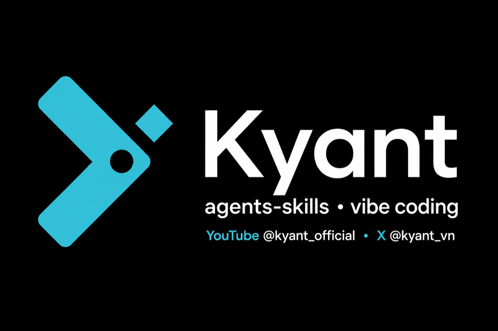

<p align="center">
  
</p>

<h1 align="center">agents-skills</h1>

<p align="center">
  <strong>Kyant</strong> toolkit — custom agents, skills, rules &amp; vibe-coding presets for
  <a href="https://claude.com/claude-code">Claude Code</a> and
  <a href="https://github.com/openai/codex">Codex</a>, built from daily livestream use.
</p>

<p align="center">
  <a href="https://www.youtube.com/@kyant_official"></a>
  <a href="https://x.com/kyant_vn"></a>
  <a href="#quick-start"></a>
  <a href="https://claude.com/claude-code"></a>
  <a href="https://github.com/openai/codex"></a>
</p>

<p align="center">
  <a href="#quick-start">Quick start</a> ·
  <a href="#usage">CLI install</a> ·
  <a href="#agents">Agents</a> ·
  <a href="#skills">Skills</a> ·
  <a href="#claudemd-presets-vibe-coding">Presets</a>
</p>

---

Part of the **Kyant** channel system (live vibe coding). No sessions, memory, or secrets are published (see [`.gitignore`](.gitignore)).

## Quick start

```bash
npx github:mxrsv/agents-skills install
```

Common one-liners:

```bash
npx github:mxrsv/agents-skills install --all
npx github:mxrsv/agents-skills install --preset kyant-vibe
npx github:mxrsv/agents-skills install --skill brainstorm --agent planner
npx github:mxrsv/agents-skills list
```

## Usage

### CLI install (recommended)

No clone needed:

```bash
npx github:mxrsv/agents-skills
npx github:mxrsv/agents-skills install
```

Interactive flow:

1. Choose what to install — everything, skills/agents/rules, a **CLAUDE.md preset**, or pick items (`1 3 5`, `1-4`, or `a`)
2. Platform — **Claude Code**, **Codex**, or **both**
3. Target — global (`~/.claude` / `~/.codex`) or local (`./.claude` / `./.codex`)
4. Skip or overwrite existing files
5. Confirm

```
════════════════════════════════════════
 agents-skills installer
════════════════════════════════════════
   1) Everything (skills + agents + commands + rules)
   2) All skills
   3) All agents
   4) All commands
   5) All rules
   6) CLAUDE.md preset…
   7) Pick specific skills…
   …

════════════════════════════════════════
 Platform
════════════════════════════════════════
   1) Claude Code  (~/.claude)
   2) Codex        (~/.codex)
   3) Both
```

Codex notes:

- Slash-commands install into `prompts/` (not `commands/`).
- Agents are skipped on Codex; skills, commands, and rules still install.

Non-interactive:

```bash
npx github:mxrsv/agents-skills install --all
npx github:mxrsv/agents-skills install --skills
npx github:mxrsv/agents-skills install --skill brainstorm --agent planner
npx github:mxrsv/agents-skills install --local --all
npx github:mxrsv/agents-skills install --codex --skills --commands
npx github:mxrsv/agents-skills install --both --skill brainstorm
npx github:mxrsv/agents-skills install --preset kyant-vibe
npx github:mxrsv/agents-skills list
npx github:mxrsv/agents-skills list presets
```

Clone once (no `npx` re-fetch):

```bash
git clone https://github.com/mxrsv/agents-skills.git
cd agents-skills
./bin/agents-skills install
```

### Manual copy

```bash
git clone https://github.com/mxrsv/agents-skills.git
cp -r agents-skills/agents   ~/.claude/agents
cp -r agents-skills/skills   ~/.claude/skills
cp -r agents-skills/commands ~/.claude/commands
cp -r agents-skills/rules    ~/.claude/rules
```

Claude Code discovers agents (`Agent` tool) and skills (`Skill` tool) from each file’s frontmatter `description` — no extra config.

## Structure

| Path                       | Role                                                    |
| -------------------------- | ------------------------------------------------------- |
| [`agents/`](agents/)       | Specialized subagents (review, planning, research…)     |
| [`skills/`](skills/)       | Skills via the Skill tool / slash commands              |
| [`commands/`](commands/)   | Custom slash commands                                   |
| [`rules/`](rules/)         | Always-loaded + path-scoped rules                       |
| [`templates/`](templates/) | `AGENTS.md` / `CLAUDE.md` starters + project structures |
| [`presets/`](presets/)     | Named `CLAUDE.md` presets (live vibe-coding)            |
| [`hooks/`](hooks/)         | File-guard (junk names, oversized files)                |
| [`assets/`](assets/)       | README media                                            |

## Agents

Claude Code discovers these via the `Agent` tool (frontmatter `description`). Codex has no per-file subagent mechanism — agents are skipped on the Codex target.

### Planning & architecture

| Agent                                      | Description                                                                              |
| ------------------------------------------ | ---------------------------------------------------------------------------------------- |
| [`analyst`](agents/analyst.md)             | Research, market/competitive analysis, brainstorming facilitation; draft docs for review |
| [`architect`](agents/architect.md)         | System architecture and technical decisions for large features/refactors                 |
| [`planner`](agents/planner.md)             | Detailed planning for complex features and refactors                                     |
| [`plan-reviewer`](agents/plan-reviewer.md) | Gate 2 — verifies a plan is executable against the codebase (read-only)                  |

### Code review & reliability

| Agent                                                              | Description                                                               |
| ------------------------------------------------------------------ | ------------------------------------------------------------------------- |
| [`code-reviewer`](agents/code-reviewer.md)                         | Gate 3 — findings-first review; reports issues before fixes               |
| [`review-recall`](agents/review-recall.md)                         | Recall-first companion review (reliability, data integrity, test quality) |
| [`review-adjudicator`](agents/review-adjudicator.md)               | Merges precision + recall reviews into one triaged verdict                |
| [`engineering-code-reviewer`](agents/engineering-code-reviewer.md) | Correctness, maintainability, security, performance — not style           |
| [`typescript-reviewer`](agents/typescript-reviewer.md)             | Deep TypeScript/JS: types, async correctness, security                    |
| [`react-reviewer`](agents/react-reviewer.md)                       | Deep React/JSX: hooks, render performance, a11y                           |
| [`database-reviewer`](agents/database-reviewer.md)                 | PostgreSQL: query optimization, schema, Supabase practices                |
| [`security-reviewer`](agents/security-reviewer.md)                 | OWASP Top 10, secrets, injection, SSRF                                    |
| [`silent-failure-hunter`](agents/silent-failure-hunter.md)         | Swallowed errors, bad fallbacks, missing error propagation                |

### Performance & maintenance

| Agent                                                      | Description                                                |
| ---------------------------------------------------------- | ---------------------------------------------------------- |
| [`performance-optimizer`](agents/performance-optimizer.md) | Bottlenecks, runtime cost, bundle size                     |
| [`refactor-cleaner`](agents/refactor-cleaner.md)           | Dead code / duplication cleanup (knip, depcheck, ts-prune) |
| [`doc-updater`](agents/doc-updater.md)                     | Codemaps and living docs (`README`, `docs/CODEMAPS`)       |

## Skills

### Discovery & planning

| Skill                                                                               | Description                                                  |
| ----------------------------------------------------------------------------------- | ------------------------------------------------------------ |
| [`brainstorm`](skills/brainstorm/SKILL.md)                                          | Before building — clarify, compare approaches, lock the spec |
| [`write-plan`](skills/write-plan/SKILL.md) / [`planning`](skills/planning/SKILL.md) | Execution plan once scope is clear                           |
| [`plan-review`](skills/plan-review/SKILL.md)                                        | After a plan, before coding — feasibility check              |
| [`codebase-onboarding`](skills/codebase-onboarding/SKILL.md)                        | Fast architecture map for unfamiliar repos                   |
| [`improve-codebase-architecture`](skills/improve-codebase-architecture/SKILL.md)    | Refactor / deepen architecture opportunities                 |
| [`deep-research`](skills/deep-research/SKILL.md)                                    | Multi-source research with citations                         |
| [`domain-modeling`](skills/domain-modeling/SKILL.md)                                | Ubiquitous language, domain terms, ADRs                      |
| [`interview-me`](skills/interview-me/SKILL.md)                                      | One-question-at-a-time interview to extract real intent      |
| [`to-spec`](skills/to-spec/SKILL.md)                                                | Turn conversation into a structured spec                     |
| [`find-skills`](skills/find-skills/SKILL.md)                                        | Discover / install agent skills                              |
| [`explain`](skills/explain/SKILL.md)                                                | Teach a concept, bug, or design decision in a chosen style   |

### Review, testing & verification

| Skill                                                                | Description                                       |
| -------------------------------------------------------------------- | ------------------------------------------------- |
| [`test-driven-development`](skills/test-driven-development/SKILL.md) | Red-Green-Refactor before new logic               |
| [`code-review`](skills/code-review/SKILL.md)                         | Parallel review → APPROVE / WARNING / BLOCK       |
| [`review`](skills/review/SKILL.md)                                   | Findings-first review of specs, plans, or code    |
| [`verification`](skills/verification/SKILL.md)                       | Require fresh evidence before “done / fixed”      |
| [`finish`](skills/finish/SKILL.md)                                   | Close-out: re-verify and summarize                |
| [`security-review`](skills/security-review/SKILL.md)                 | Auth, input, secrets, payments                    |
| [`e2e-testing`](skills/e2e-testing/SKILL.md)                         | Playwright + Page Object patterns                 |
| [`docs-drift`](skills/docs-drift/SKILL.md)                           | Docs vs real code behavior (read-only by default) |
| [`diagnosing-bugs`](skills/diagnosing-bugs/SKILL.md)                 | Hard bugs and performance regressions             |
| [`triage`](skills/triage/SKILL.md)                                   | Categorise issues into agent-ready briefs         |

### Frontend & prototyping

| Skill                                                                      | Description                                    |
| -------------------------------------------------------------------------- | ---------------------------------------------- |
| [`frontend-design-bar`](skills/frontend-design-bar/SKILL.md)               | UI that looks designed, not generic            |
| [`frontend-design-direction`](skills/frontend-design-direction/SKILL.md)   | Product-specific frontend design direction     |
| [`frontend-design-audit`](skills/frontend-design-audit/SKILL.md)           | Usability audit for existing UIs / live sites  |
| [`prototype`](skills/prototype/SKILL.md)                                   | Throwaway prototype before committing          |
| [`html-artifact`](skills/html-artifact/SKILL.md)                           | Self-contained HTML artifact (explicit invoke) |
| [`manim-video`](skills/manim-video/SKILL.md)                               | Technical explainer videos with Manim          |
| [`design-taste-frontend`](skills/design-taste-frontend/SKILL.md)           | Anti-slop landing / portfolio taste            |
| [`high-end-visual-design`](skills/high-end-visual-design/SKILL.md)         | Agency-level visual + motion standards         |
| [`imagegen-frontend-web`](skills/imagegen-frontend-web/SKILL.md)           | Section-by-section visual references           |
| [`impeccable`](skills/impeccable/SKILL.md)                                 | Critique, polish, improve interfaces           |
| [`redesign-existing-projects`](skills/redesign-existing-projects/SKILL.md) | Upgrade existing apps without breaking them    |
| [`shadcn`](skills/shadcn/SKILL.md)                                         | shadcn/ui components, registries, chat UI      |

### Content, docs & workflow

| Skill                                                                  | Description                                               |
| ---------------------------------------------------------------------- | --------------------------------------------------------- |
| [`content-engine`](skills/content-engine/SKILL.md)                     | Multi-platform content (X, LinkedIn, TikTok, newsletters) |
| [`create-doc`](skills/create-doc/SKILL.md)                             | Template-driven PRDs, research reports, briefs            |
| [`git-workflow`](skills/git-workflow/SKILL.md)                         | Branching, conventional commits, merge/rebase             |
| [`github-ops`](skills/github-ops/SKILL.md)                             | Issues, PRs, CI, releases via `gh`                        |
| [`team-agent-orchestration`](skills/team-agent-orchestration/SKILL.md) | Multi-agent squad: work items, ownership, merge gates     |
| [`hand-off`](skills/hand-off/SKILL.md)                                 | Compact the conversation for another agent                |
| [`teach`](skills/teach/SKILL.md)                                       | Teach a skill or concept in-workspace                     |
| [`context-budget`](skills/context-budget/SKILL.md)                     | Audit token use across agents, skills, MCP, `CLAUDE.md`   |
| [`caveman`](skills/caveman/SKILL.md)                                   | Ultra-compressed communication mode                       |

### Shared external skills

Installed under `~/.agents/skills` and symlinked into Claude Code / Codex. The CLI skips broken symlinks by default; use `--with-symlinks` when targets exist.

| Skill                                                                      | Upstream                                                                          |
| -------------------------------------------------------------------------- | --------------------------------------------------------------------------------- |
| [`caveman`](skills/caveman/SKILL.md)                                       | [juliusbrussee/caveman](https://github.com/juliusbrussee/caveman)                 |
| [`design-taste-frontend`](skills/design-taste-frontend/SKILL.md)           | [leonxlnx/taste-skill](https://github.com/leonxlnx/taste-skill)                   |
| [`frontend-design-audit`](skills/frontend-design-audit/SKILL.md)           | [mistyhx/frontend-design-audit](https://github.com/mistyhx/frontend-design-audit) |
| [`high-end-visual-design`](skills/high-end-visual-design/SKILL.md)         | [leonxlnx/taste-skill](https://github.com/leonxlnx/taste-skill)                   |
| [`imagegen-frontend-web`](skills/imagegen-frontend-web/SKILL.md)           | [leonxlnx/taste-skill](https://github.com/leonxlnx/taste-skill)                   |
| [`impeccable`](skills/impeccable/SKILL.md)                                 | [pbakaus/impeccable](https://github.com/pbakaus/impeccable)                       |
| [`redesign-existing-projects`](skills/redesign-existing-projects/SKILL.md) | [leonxlnx/taste-skill](https://github.com/leonxlnx/taste-skill)                   |
| [`diagnosing-bugs`](skills/diagnosing-bugs/SKILL.md)                       | [mattpocock/skills](https://github.com/mattpocock/skills)                         |
| [`triage`](skills/triage/SKILL.md)                                         | [mattpocock/skills](https://github.com/mattpocock/skills)                         |
| [`shadcn`](skills/shadcn/SKILL.md)                                         | [shadcn-ui/ui](https://github.com/shadcn-ui/ui)                                   |

## CLAUDE.md presets (vibe coding)

**Kyant** livestream preset + a neutral template you can fork.

| Path                                                           | What it is                                                                                |
| -------------------------------------------------------------- | ----------------------------------------------------------------------------------------- |
| [`templates/CLAUDE.template.md`](templates/CLAUDE.template.md) | Neutral global `CLAUDE.md` — fill `{{placeholders}}`                                      |
| [`presets/kyant-vibe/`](presets/kyant-vibe/)                   | **Kyant** vibe-coding preset (Vietnamese tone, short answers, frontend gates, hard rules) |

```bash
npx github:mxrsv/agents-skills install --preset kyant-vibe
cp templates/CLAUDE.template.md ~/.claude/CLAUDE.md   # or start from template
```

Presets write `CLAUDE.md` at the install target. Pair with [`rules/`](rules/) so hard-rule links resolve. Fork the preset — language and emoji policy are taste, not law.

## Rules & templates

| Path                                                               | What                                                                                     |
| ------------------------------------------------------------------ | ---------------------------------------------------------------------------------------- |
| [`rules/core/`](rules/core/)                                       | Always-loaded: file creation (F), workflow (W), docs (D), coding style (C), patterns (P) |
| [`rules/typescript/`](rules/typescript/)                           | Path-scoped for `*.ts/tsx/js/jsx`                                                        |
| [`rules/react/`](rules/react/)                                     | Path-scoped for `*.tsx/jsx`                                                              |
| [`templates/AGENTS.template.md`](templates/AGENTS.template.md)     | Per-project delta rules skeleton                                                         |
| [`templates/CLAUDE.template.md`](templates/CLAUDE.template.md)     | Neutral `CLAUDE.md` starter                                                              |
| [`templates/project-structure.md`](templates/project-structure.md) | Canonical directory trees                                                                |
| [`hooks/file-guard.sh`](hooks/file-guard.sh)                       | Blocks junk filenames; warns on oversized / misplaced files                              |
