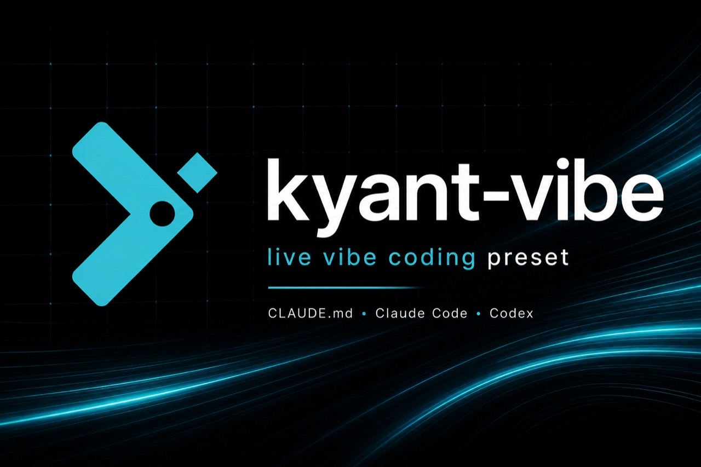

<p align="center">
  
</p>

<h1 align="center"><code>kyant-vibe</code></h1>

<p align="center">
  <strong>Kyant</strong> livestream vibe-coding preset — the <code>CLAUDE.md</code> used on stream.
</p>

<p align="center">
  <a href="https://www.youtube.com/@kyant_official"></a>
  <a href="https://x.com/kyant_vn"></a>
  <a href="../../README.md"></a>
</p>

---

## What’s in this folder

| File                         | Role                                                                                           |
| ---------------------------- | ---------------------------------------------------------------------------------------------- |
| [`banner.jpg`](./banner.jpg) | Preset hero banner (Kyant vibe-coding)                                                         |
| [`CLAUDE.md`](./CLAUDE.md)   | Global agent operating rules (tone, conciseness, frontend gates, hard rules L1–L10, branching) |
| [`AGENTS.md`](./AGENTS.md)   | Entry for Codex / Cursor — `@CLAUDE.md`                                                        |
| [`README.md`](./README.md)   | This page — install + map to the rest of the toolkit                                           |

**This folder is not the whole toolkit.** Hard rules, agents, and skills live elsewhere in the repo (see [References](#references)).

## What’s inside `CLAUDE.md`

| Block                                   | What it controls                                                             |
| --------------------------------------- | ---------------------------------------------------------------------------- |
| `<communication>`                       | Vietnamese conversational tone, emoji policy, when to ask for clarification  |
| `<conciseness>`                         | Short answers by default — no essay unless asked                             |
| `<frontend_design>` / `<frontend_gate>` | Design bar + lock IDEA/APPROACH before UI work                               |
| `<hard_rules>`                          | L1–L10 — file creation, verify-before-done, scope, brainstorm/plan, commits… |
| `<branching>`                           | No auto-branch; worktree when a branch _is_ created                          |

Hard-rule details are **not** duplicated here — they point at [`rules/core/`](../../rules/core/).

## Install

**Recommended** (writes `CLAUDE.md` to your Claude Code / Codex root):

```bash
npx github:mxrsv/agents-skills install --preset kyant-vibe
```

**Full Kyant stack** (skills + agents + rules + this preset):

```bash
npx github:mxrsv/agents-skills install --all
npx github:mxrsv/agents-skills install --preset kyant-vibe --force
```

**Manual:**

```bash
git clone https://github.com/mxrsv/agents-skills.git
cp agents-skills/presets/kyant-vibe/CLAUDE.md ~/.claude/CLAUDE.md
cp -r agents-skills/rules ~/.claude/rules   # needed for L1–L10 links
```

> Prefer a blank starter instead of Kyant’s voice? Use [`templates/CLAUDE.template.md`](../../templates/CLAUDE.template.md).

## References

### Must-pair (this preset expects these)

| Path                                                                     | Why                                                       |
| ------------------------------------------------------------------------ | --------------------------------------------------------- |
| [`rules/core/file-creation.md`](../../rules/core/file-creation.md)       | F-rules — L1, L3, L4                                      |
| [`rules/core/workflow.md`](../../rules/core/workflow.md)                 | W-rules — L5–L8 (verify, scope, brainstorm/plan, commits) |
| [`rules/core/docs.md`](../../rules/core/docs.md)                         | D-rules — L9                                              |
| [`rules/core/coding-style.md`](../../rules/core/coding-style.md)         | Coding style baseline                                     |
| [`rules/core/patterns.md`](../../rules/core/patterns.md)                 | Shared engineering patterns                               |
| [`templates/project-structure.md`](../../templates/project-structure.md) | L2 — where new files/modules go                           |
| [`templates/AGENTS.template.md`](../../templates/AGENTS.template.md)     | L10 — per-repo `AGENTS.md` delta                          |
| [`templates/CLAUDE.template.md`](../../templates/CLAUDE.template.md)     | Neutral `CLAUDE.md` if you don’t want Kyant tone          |

### Path-scoped rules (loaded when you touch those files)

| Path                                           | When                                |
| ---------------------------------------------- | ----------------------------------- |
| [`rules/typescript/`](../../rules/typescript/) | `*.ts` / `*.tsx` / `*.js` / `*.jsx` |
| [`rules/react/`](../../rules/react/)           | `*.tsx` / `*.jsx`                   |

### Rest of the Kyant toolkit

| Path                                | What                                                      |
| ----------------------------------- | --------------------------------------------------------- |
| [Repo root README](../../README.md) | Banner, full agent/skill catalog, CLI usage               |
| [`agents/`](../../agents/)          | Subagents (planner, reviewers, …)                         |
| [`skills/`](../../skills/)          | Invokable skills (`brainstorm`, `frontend-design-bar`, …) |
| [`commands/`](../../commands/)      | Slash commands                                            |
| [`hooks/`](../../hooks/)            | File-guard (junk names, oversized files)                  |
| [`assets/`](../../assets/)          | Kyant logo + README banner                                |

### Channels

| Platform | Link                                                                   |
| -------- | ---------------------------------------------------------------------- |
| YouTube  | [youtube.com/@kyant_official](https://www.youtube.com/@kyant_official) |
| X        | [x.com/kyant_vn](https://x.com/kyant_vn)                               |

## Adapt

Fork freely. Change language, emoji policy, and conciseness to match your stream or team. Keep the **hard-rules skeleton** + install [`rules/`](../../rules/) if you want the same safety rails — the vibe layer is taste; the rails are the system.
